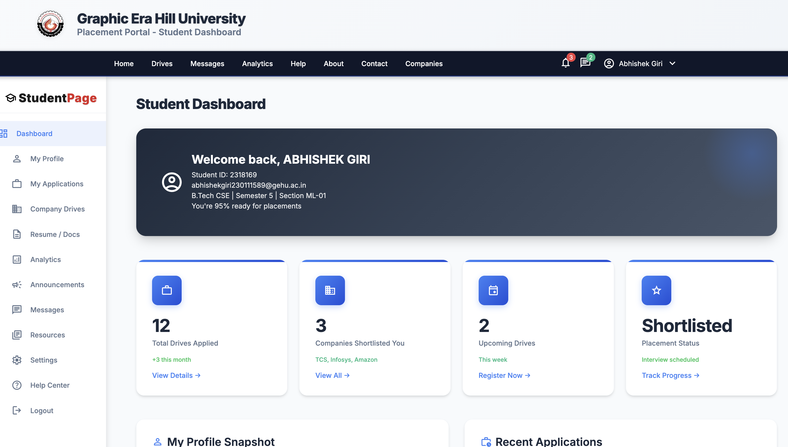
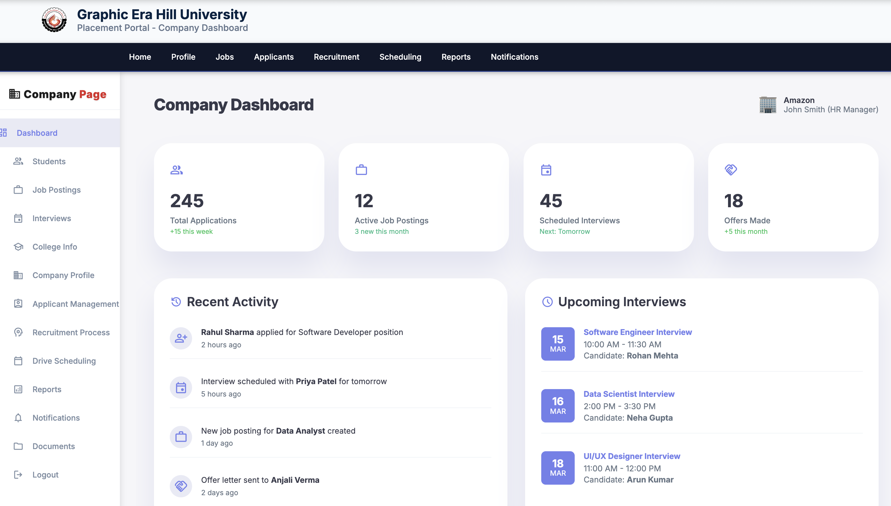

<h1 align="center">🎓 GEHU Aspire — Smart Placement Portal</h1>

<p align="center">
  🚀 A comprehensive placement management system for Graphic Era Hill University (GEHU) that connects students, companies, and administrators with modern web technologies and professional UI/UX design.
</p>

<p align="center">
  
  
  
  
</p>
<br>

---

## 📖 Problem Statement
University placement processes are often fragmented, with students, companies, and administrators using separate systems. Traditional methods lack real-time updates, comprehensive analytics, and seamless communication channels required for modern placement management.

<br>

---

## 💡 Our Solution
GEHU Aspire is a unified web-based placement portal designed to:

- 📊 Streamline placement drives and application management
- 🎓 Provide comprehensive student profile and resume management
- 🏢 Enable efficient company dashboard for job postings
- 👨‍💼 Offer powerful admin controls for system management
- 📈 Deliver real-time analytics and placement insights
- 💬 Facilitate seamless communication between all stakeholders

<br>

---  

## 🚀 Features

✅  **Student Dashboard** with profile management and application tracking  
✅  **Company Portal** for job postings and candidate management  
✅  **Admin Panel** with comprehensive system controls  
✅  **Responsive Design** optimized for all devices  
✅  **Real-time Notifications** and messaging system  
✅  **Analytics Dashboard** with placement insights  
✅  **Resume Management** with PDF upload/download  
✅  **Professional UI** with modern design patterns

<br>

---  

## 🛠️ Tech Stack

<div align="center">

<table>
<thead>
<tr>
<th>🖥️ Technology</th>
<th>⚙️ Description</th>
</tr>
</thead>
<tbody>
<tr>
<td></td>
<td>Semantic markup and structure</td>
</tr>
<tr>
<td></td>
<td>Modern styling with CSS Grid and Flexbox</td>
</tr>
<tr>
<td></td>
<td>Interactive functionality and DOM manipulation</td>
</tr>
<tr>
<td></td>
<td>Google Material Design icons</td>
</tr>
<tr>
<td></td>
<td>Modern typography with Google Fonts</td>
</tr>
</tbody>
</table>

</div>

<br>

---

## 📁 Project Directory Structure

```
GEHU-Smart_Placement_Portal/
├── 📂 assets/
│   └── 📂 images/                  # 🖼️ All project images and logos
│       ├── 📄 favicon.png          # 🔖 Browser tab icon
│       ├── 📄 navbar-logo.png      # 🏛️ GEHU header logo
│       └── 📄 *.png/*.jpg          # 🏢 Company logos and assets
├── 📂 src/
│   ├── 📂 pages/                   # 📄 HTML pages
│   │   ├── 📄 index.html           # 🏠 Landing page
│   │   ├── 📄 student-dashboard.html # 🎓 Student portal
│   │   ├── 📄 company-dashboard.html # 🏢 Company portal
│   │   ├── 📄 admin-dashboard.html   # 👨‍💼 Admin panel
│   │   ├── 📄 login-page.html        # 🔐 Authentication
│   │   └── 📄 *.html                 # 📋 Other pages
│   ├── 📂 styles/                  # 🎨 CSS stylesheets
│   │   ├── 📄 student-dashboard.css  # 🎓 Student styling
│   │   ├── 📄 company-dashboard.css  # 🏢 Company styling
│   │   └── 📄 *.css                  # 🎨 Other styles
│   └── 📂 scripts/                 # ⚡ JavaScript files
│       ├── 📄 student-dashboard.js   # 🎓 Student functionality
│       ├── 📄 company-dashboard.js   # 🏢 Company functionality
│       └── 📄 *.js                   # ⚡ Other scripts
├── 📂 docs/                        # 📖 Documentation files
└── 📄 README.md                    # 📖 Project documentation
```

<br>

## 📸 Preview Images

| 📍 Dashboard / Feature          | 📸 Screenshot                                    |
|:-------------------------------|:------------------------------------------------|
| Landing Page                   |           |
| Student Dashboard              |  |
| Company Portal                 |    |
| Admin Panel                    |         |

<br>

---

## 📦 How to Run

### 📌 Prerequisites
- ✅ **Modern Web Browser** (Chrome, Firefox, Safari, Edge)
- ✅ **Local Web Server** (optional for development)

<br>

---  

### 🚀 Quick Start

1. **Clone the repository:**
   ```bash
   git clone https://github.com/abhishekgiri04/GEHU-Smart_Placement_Portal.git
   cd GEHU-Smart_Placement_Portal
   ```

2. **Open the application:**
   ```bash
   # Option 1: Direct file access
   open src/pages/index.html
   
   # Option 2: Local server (recommended)
   python -m http.server 8000
   # Then visit: http://localhost:8000/src/pages/index.html
   ```

3. **Navigate through dashboards:**
   - **Students:** `src/pages/student-dashboard.html`
   - **Companies:** `src/pages/company-dashboard.html`
   - **Administrators:** `src/pages/admin-dashboard.html`

<br>

---

## 🌐 Live Demo

### 🚀 Netlify Deployment

**Live URL:** [https://gehu-placement-portal.netlify.app](https://gehu-placement-portal.netlify.app)

### 📦 Deploy on Netlify

1. **GitHub Integration:**
   ```bash
   # Connect your GitHub account to Netlify
   # Select GEHU-Smart_Placement_Portal repository
   # Deploy settings:
   Build command: (leave empty)
   Publish directory: .
   ```

2. **Manual Deploy:**
   - Download project as ZIP
   - Drag & drop to Netlify dashboard
   - Instant deployment

3. **One-Click Deploy:**
   [](https://app.netlify.com/start/deploy?repository=https://github.com/abhishekgiri04/GEHU-Smart_Placement_Portal)

<br>

---

## 📖 Core Components

* **Student Dashboard** — Profile management, application tracking, and placement analytics
* **Company Portal** — Job posting management and candidate evaluation
* **Admin Panel** — System administration and comprehensive analytics
* **Authentication System** — Secure login for all user types
* **Responsive Design** — Mobile-first approach with modern UI patterns
* **Real-time Features** — Notifications, messaging, and live updates

<br>

---

## 🌐 Key Pages & Features

```bash
# Main Application Pages
/src/pages/index.html              # Landing page with navigation
/src/pages/student-dashboard.html  # Student portal and features
/src/pages/company-dashboard.html  # Company management interface
/src/pages/admin-dashboard.html    # Administrative controls

# Authentication & Registration
/src/pages/login-page.html         # Unified login system
/src/pages/student-register.html   # Student registration
/src/pages/company-register.html   # Company registration
```

<br>

---

## 🎨 Design Features

- **Modern UI/UX** — Clean, professional interface design
- **Responsive Layout** — Optimized for desktop, tablet, and mobile
- **Material Design** — Google Material Icons and design principles
- **Color Scheme** — Professional blue and white theme
- **Typography** — Inter and Roboto fonts for readability
- **Animations** — Smooth transitions and hover effects

<br>

---

## 📊 Dashboard Features

### 🎓 Student Dashboard
- Profile management with edit functionality
- Application tracking and status updates
- Resume upload and management
- Placement drive notifications
- Analytics and progress tracking

### 🏢 Company Dashboard
- Job posting and management
- Candidate application review
- Interview scheduling
- Company profile management
- Recruitment analytics

### 👨‍💼 Admin Dashboard
- System-wide analytics and reports
- User management (students/companies)
- Placement drive coordination
- Data export and reporting
- System configuration

<br>

---

## 🌱 Future Enhancements
- 📱 **Mobile Application** — Native iOS and Android apps
- 🔔 **Push Notifications** — Real-time alerts and updates
- 📊 **Advanced Analytics** — AI-powered placement insights
- 🔐 **Enhanced Security** — Two-factor authentication
- 🌐 **API Integration** — Third-party service connections
- 📧 **Email Integration** — Automated communication system

<br>

---  

## 📞 Help & Contact  

> 💬 *Got questions or need assistance with GEHU Aspire Platform?*  
> We're here to help with technical support and collaboration!

<div align="center">

**👤 Abhishek Giri**  
<a href="https://www.linkedin.com/in/abhishek-giri04/">
  
</a>  
<a href="https://github.com/abhishekgiri04">
  
</a>  
<a href="https://t.me/AbhishekGiri7">
  
</a>

<br/>

---

**🎓 Built with ❤️ for GEHU Excellence**  
*Transforming University Placements Through Modern Technology*

</div>

---

<div align="center">

**© 2025 GEHU Aspire - Smart Placement Portal. All Rights Reserved.**

</div>